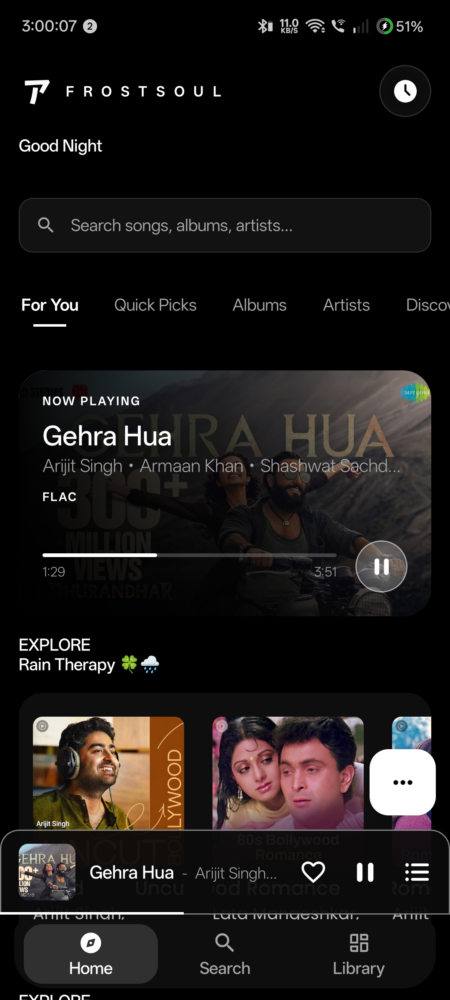
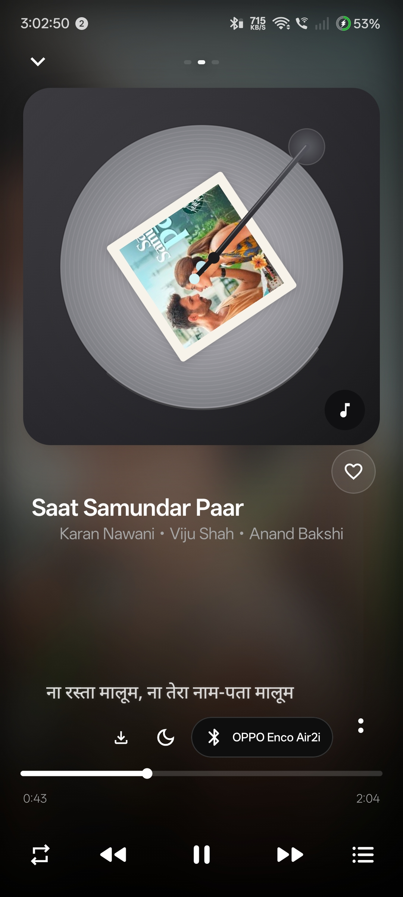
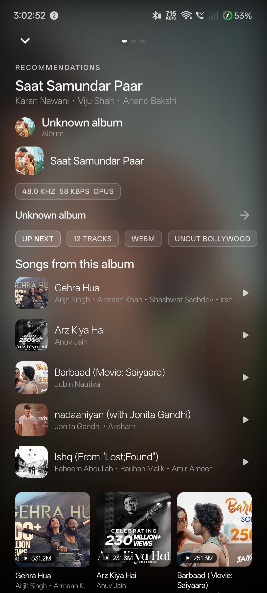
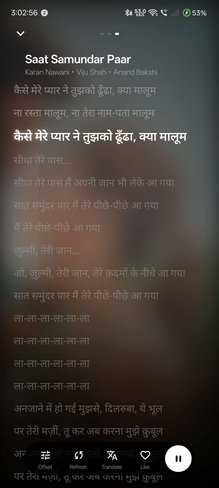

# FrostSoulX
[frostsoulx repo](https://github.com/sakuraDev31/frostsoulx.git)

[Download APK v14.0.2](https://github.com/sakuraDev31/frostsoulx/releases/download/V14.0.2/app-gms-mobile-arm64-debug.apk)
 
 **A clean, focused Android music player for people who care about the listening experience.**

[](https://github.com/sakuraDev31/frostsoulx/tree/frostsoul-reboot)
[](https://kotlinlang.org/)
[](https://developer.android.com/compose)
[](https://developer.android.com/media/media3)
[](LICENSE)

FrostSoulX is an independent Kotlin and Jetpack Compose music player with Media3 playback, synchronized lyrics, local persistence, artwork-driven player styles, background playback, and a simple Home, Search, and Library navigation model.

> FrostSoulX is an independent project. It is not an official Google, YouTube, or YouTube Music application. It does not reproduce proprietary application source code or proprietary application assets.

[**Features**](#features) • [**Screenshots**](#screenshots) • [**Build**](#build-from-source) • [**Credits**](#credits) • [**License**](#license)

## Screenshots

| Home | Vinyl player |
| --- | --- |
|  |  |

| Recommendations | Lyrics |
| --- | --- |
|  |  |

## Features

### Playback

- Media3 background playback and Android media controls
- Queue management, seeking, repeat, playback speed, downloads, and sleep timer
- Audio-output device selection and local media support
- Artwork metadata delivered to system notifications and media controls

### Player

- Vinyl player with turntable-inspired artwork presentation
- Artwork Blur player with seamless blurred artwork and readable lyric contrast
- Three-page player navigation for recommendations, player, and lyrics
- Compact mini player with responsive gesture-aware controls

### Lyrics and discovery

- Synchronized line and word-level karaoke lyrics with white fill and glow
- Per-track lyrics timing offset, refetch, translation, and artist navigation
- Home discovery, search, recommendations, artist profiles, albums, playlists, and library views
- Artwork palette extraction for player backgrounds and ambient visual treatment

## Build from source

Requirements: Android Studio, Android SDK, JDK 21, and the included Gradle Wrapper.

```bash
git clone --branch frostsoul-reboot https://github.com/sakuraDev31/frostsoulx.git
cd frostsoulx
./gradlew assembleGmsMobileArm64Debug --no-daemon --build-cache
```

The debug workflow uses the same `assembleGmsMobileArm64Debug` task. Generated APKs are placed under `app/build/outputs/apk/`.

## Download and CI

The active development branch is [`frostsoul-reboot`](https://github.com/sakuraDev31/frostsoulx/tree/frostsoul-reboot). Pushes and pull requests can run the [Debug APK workflow](https://github.com/sakuraDev31/frostsoulx/actions/workflows/Debug.yml), which builds and uploads the arm64 debug APK as an artifact.

Signed release builds require the repository’s configured release secrets. Do not commit API keys, signing passwords, keystores, or `local.properties` files.

## Credits

FrostSoulX acknowledges the open-source projects and contributors whose work provides foundation, references, or inspiration:

- **[ArchiveTune](https://github.com/rukamori/ArchiveTune)** for the upstream Android music-player foundation and applicable source notices.
- **[InnerTube](https://github.com/tombulled/innertube)** for YouTube and YouTube Music data-model/client integration reference.
- **[Metrolist](https://github.com/mostafaalagamy/Metrolist)** for open-source Android music-player architecture and implementation inspiration.

FrostSoulX is independently maintained. The names, licenses, notices, trademarks, and original contributions of credited projects remain their respective owners’ property.

## License

FrostSoulX is distributed under the [GNU General Public License v3.0](LICENSE). Review the license and source notices before redistributing modified builds.

FrostSoulX is not affiliated with Google, YouTube, YouTube Music, or any other service referenced by the application. Users are responsible for complying with the terms and laws applicable to the services they access.

## Links

- [Source code](https://github.com/sakuraDev31/frostsoulx/tree/frostsoul-reboot)
- [Issues](https://github.com/sakuraDev31/frostsoulx/issues)
- [Pull requests](https://github.com/sakuraDev31/frostsoulx/pulls)
- [Contributing guide](CONTRIBUTING.md)
- [License](LICENSE)
